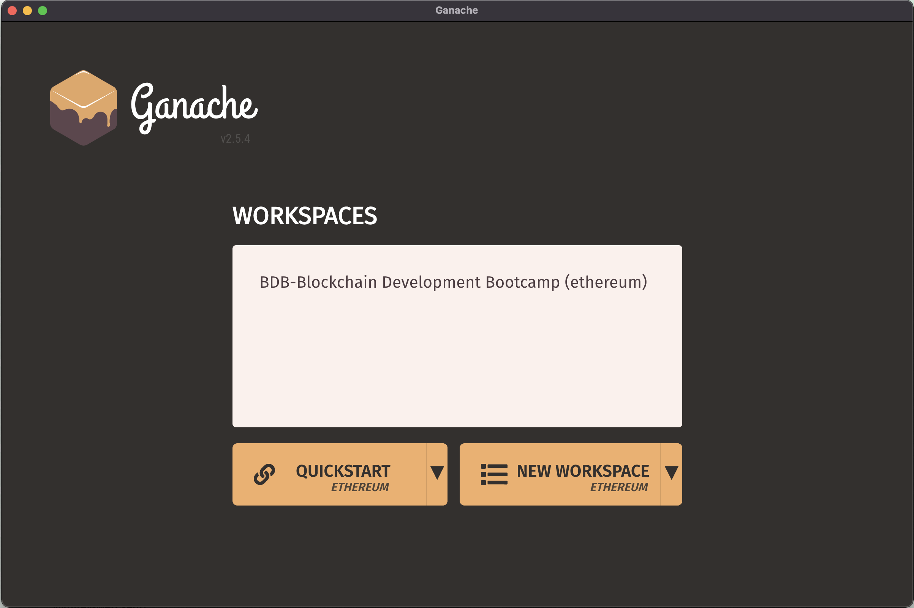
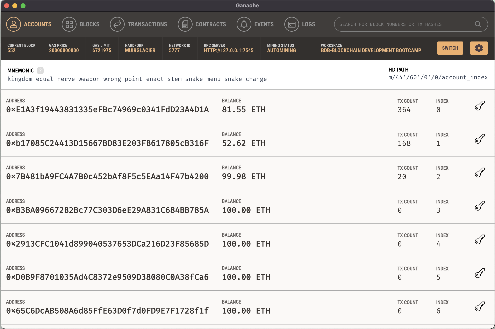
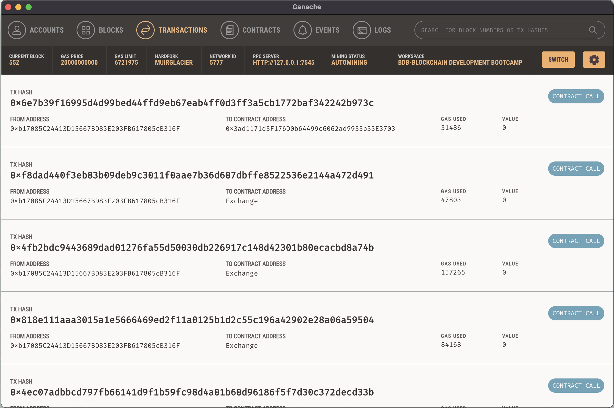

# BDB/ETH Exchange - Decentralised Application

BDB/ETH Exchange is a Decentralised Application build on React JS with Ethereum Smart Contract.


## Installation & Pre-Requisites (MAC OS)
Below are the required software for the development and execiution of the Project of this Project.

- Visual Code Studio -``` https://code.visualstudio.com/?wt.mc_id=DX_841432 ```
- NodeJS(NPM) - ``` https://nodejs.org/en/ ```
- Truffle - ``` npm install truffle -g ```
- Ganache - ``` https://www.trufflesuite.com/ganache ```
- GIT - ``` git --version (Install via XCode Tool) ```

Apart from above software we also required below tools or account:
- Github - Git Client to store the code base and sharing with coworkers. https://github.com/Consensys-Bootcamp/blockchain-developer-bootcamp-final-project   
- Heroku - To host the decntralised app Developed using react JS. https://bdb-token-exchange.herokuapp.com/
- Infura - This will required to connect to Ropsten TestNet. Infura Provides API Serrvice for Blockcahin.```https://infura.io/```
- Faucet Ropsten - This will required to get rETH for deployment on TestNet.```https://faucet.dimensions.network/```

## Smart Contract & Application
# Smart Contract
Smart Contract Token and Exchange are deployed on local network and ropsten network. Here is the step to do so:
-  ```npm install```  - To Install dependancies
-  ```truffle compile``` - To Compile the Smart Contract
-  ```truffle test``` - To Execute the Unit Test Cases
-  ```truffle migrate --network development``` - To Migrate the Smart Contract to Development Network
-  ```truffle migrate --network ropsten``` - To Migrate the Smart Contract to Ropsten Network

# Application
- ```npm start```
- http://localhost:3000/
- Application hosted on Heroku : https://bdb-token-exchange.herokuapp.com/ ```git push heroku main```
- Appliction hosted on GitHub : https://consensys-bootcamp.github.io/bdb-token-exchange/ 
# Seeding the Exchange
- Seed with some transaction on local development network.
  ```truffle exec script/seed-exchange.js --network development```
- Seed with some transaction on ropsten test network.
  ```truffle exec script/seed-exchange.js --network ropsten```
# ScreenCast
  [](https://www.youtube.com/watch?v=7liH9H8SsKw)
# Screenshots
- Project Structure
  - 
  - 
- Ganache & Metamask
  - 
  - 
  - 
- Ropsten Testnet
  - 
  - 
  - 
- Exchange Application

##ToDo
- Collect ropsten ETH for proper testing
- Handle Exception with proper message
- Is Ownable and Is ERC20 extend implementation
- Improve the Decntralised App UI & Error Handling


